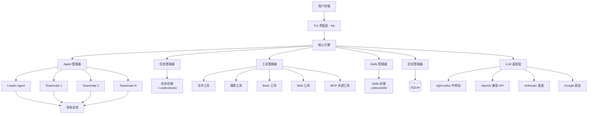
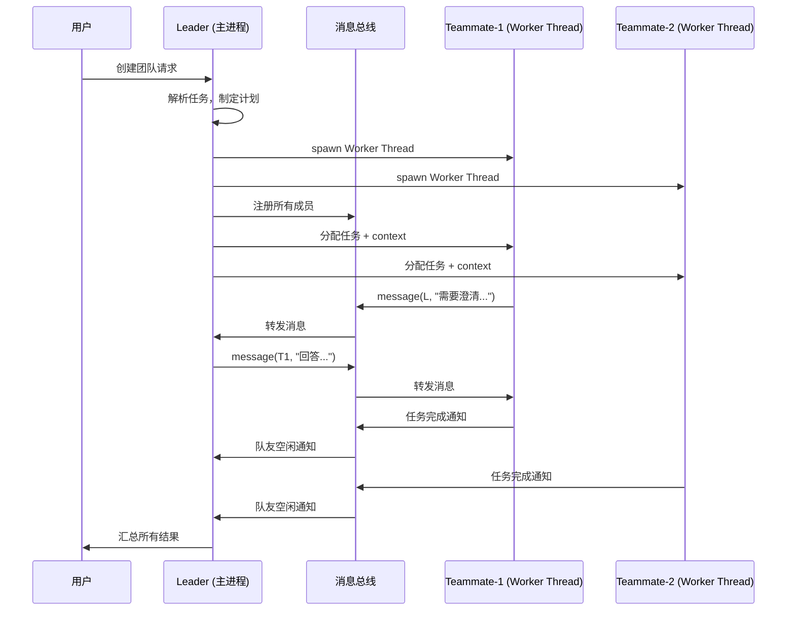

# CodexAgentTeams — 带有 Agent Teams 功能的 Node.js CLI 工具

基于 [OpenCode](https://github.com/anomalyco/opencode) 的架构设计理念和 [Claude Code Agent Teams](https://code.claude.com/docs/zh-CN/agent-teams) 的多代理协作机制，在 Windows 下构建一个 Node.js CLI 工具。

---

## 项目概览

### 目标

构建一个终端 AI 编码助手，核心特性：
1. **多 Agent 架构**：支持 Primary Agent（Build/Plan）+ Subagent（General/Explore），可通过配置自定义
2. **Agent Teams 协作**：支持一个负责人（Leader）协调多个队友（Teammate），并行执行任务
3. **共享任务列表**：所有 Agent 可见的任务看板，支持分配、认领、状态追踪
4. **代理间消息传递**：支持 message（定向）和 broadcast（广播）通信
5. **丰富的工具集**：文件读写、代码搜索、Bash 执行、Web 搜索等
6. **TUI 界面**：基于 Ink（React for CLI）的终端界面
7. **Windows 原生支持**：不依赖 tmux，使用 in-process 模式管理队友

### 与参考项目的对比

| 特性 | OpenCode | Claude Code Agent Teams | 本项目 |
|------|----------|------------------------|--------|
| 语言 | Go/TypeScript | 闭源（Node.js） | **Node.js/TypeScript** |
| Agent 模式 | Primary + Subagent | Leader + Teammates | **两者兼备** |
| 多 Agent 协作 | 无 Agent Teams | ✅ | ✅ |
| TUI 框架 | BubbleTea (Go) | Ink | **Ink (React for CLI)** |
| Windows 支持 | 部分 | 需 tmux | **原生 in-process 模式** |
| 提供商无关 | ✅ | 仅 Anthropic | **✅ 多提供商 (right.codes 中转优先)** |
| MCP 支持 | ✅ | ✅ | **✅ 核心支持** |
| Skills 系统 | 无 | 无 | **✅ 自定义技能** |

---

## 技术选型

| 类别 | 选择 | 理由 |
|------|------|------|
| 语言 | TypeScript 5.x | 类型安全、生态丰富 |
| 运行时 | Node.js 20+ | LTS 稳定版，原生 ES Module |
| 包管理 | pnpm | 速度快，monorepo 友好 |
| CLI 框架 | Commander.js | 成熟的命令行解析 |
| TUI 界面 | Ink 5 (React for CLI) | 声明式 UI、组件化 |
| LLM SDK | Vercel AI SDK | 多提供商统一接口，支持 OpenAI 兼容中转 |
| 默认 LLM 提供商 | **right.codes 中转站** | 统一 API Key，免配置多家 API |
| 进程管理 | Node.js `worker_threads` | Worker Threads，Windows 原生支持 |
| IPC 通信 | MessagePort + EventEmitter | Worker Threads 原生通信 |
| 数据存储 | SQLite (better-sqlite3) | 会话历史、任务持久化 |
| 配置管理 | cosmiconfig | 支持多格式配置文件 |
| MCP 协议 | `@modelcontextprotocol/sdk` | MCP 客户端，接入外部工具服务 |
| Skills 系统 | 自研 Markdown-based | 类似 OpenCode 的 Agent 配置加 Skill 脚本 |

---

## 架构设计

### 整体架构



### Agent Teams 进程模型（Windows 适配）



> [!IMPORTANT]
> 在 Windows 下不使用 tmux（不支持），而是使用 **Node.js Worker Threads** 作为队友的隔离执行环境。每个队友在独立的 Worker Thread 中运行，通过 `MessagePort` 进行高效 IPC 通信。这是核心的 Windows 适配策略。

---

## 项目目录结构

```
codexagentteams/
├── package.json
├── tsconfig.json
├── pnpm-lock.yaml
├── .env.example                   # RC_API_KEY, RC_BASE_URL 等
├── codex.config.json              # 默认配置（含 right.codes 中转配置）
│
├── src/
│   ├── index.ts                   # 入口点
│   ├── cli.ts                     # Commander.js CLI 定义
│   │
│   ├── core/                      # 核心引擎
│   │   ├── engine.ts              # 主引擎协调器
│   │   ├── config.ts              # 配置加载 (cosmiconfig)
│   │   └── logger.ts              # 日志系统
│   │
│   ├── agent/                     # Agent 系统
│   │   ├── types.ts               # Agent 类型定义
│   │   ├── registry.ts            # Agent 注册表
│   │   ├── primary/               # Primary Agents
│   │   │   ├── build-agent.ts     # Build Agent - 全功能开发
│   │   │   └── plan-agent.ts      # Plan Agent - 只读分析
│   │   ├── subagent/              # Subagents
│   │   │   ├── general-agent.ts   # 通用搜索/多步骤任务
│   │   │   └── explore-agent.ts   # 代码探索
│   │   └── custom-loader.ts       # 自定义 Agent 加载器 (JSON/Markdown)
│   │
│   ├── teams/                     # Agent Teams 系统 ⭐
│   │   ├── types.ts               # Teams 类型定义
│   │   ├── leader.ts              # Leader 负责人逻辑
│   │   ├── teammate.ts            # Teammate 队友逻辑
│   │   ├── team-manager.ts        # 团队生命周期管理
│   │   ├── message-bus.ts         # 消息总线 (message/broadcast)
│   │   ├── task-board.ts          # 共享任务看板
│   │   ├── worker-entry.ts        # Worker Thread 入口
│   │   └── display/               # 显示模式
│   │       ├── in-process.ts      # in-process 显示
│   │       └── renderer.ts        # 团队状态渲染
│   │
│   ├── tools/                     # 工具系统
│   │   ├── types.ts               # 工具接口定义
│   │   ├── registry.ts            # 工具注册表
│   │   ├── permission.ts          # 权限管理 (allow/deny/ask)
│   │   ├── builtin/               # 内置工具
│   │   │   ├── read.ts            # 文件读取
│   │   │   ├── write.ts           # 文件写入
│   │   │   ├── edit.ts            # 文件编辑
│   │   │   ├── bash.ts            # 命令执行 (PowerShell)
│   │   │   ├── grep.ts            # ripgrep 搜索
│   │   │   ├── glob.ts            # 文件模式匹配
│   │   │   ├── list.ts            # 目录列表
│   │   │   ├── patch.ts           # 补丁应用
│   │   │   ├── web-fetch.ts       # 网页抓取
│   │   │   └── web-search.ts      # 网页搜索
│   │   └── mcp/                   # MCP 协议支持 ⭐
│   │       ├── client.ts          # MCP 客户端 (stdio/SSE 传输)
│   │       ├── loader.ts          # MCP 服务器配置加载
│   │       └── registry.ts        # MCP 工具自动注册
│   │
│   ├── skills/                    # Skills 系统 ⭐ 新增
│   │   ├── types.ts               # Skill 类型定义
│   │   ├── loader.ts              # Skill 加载器 (Markdown + 脚本)
│   │   ├── registry.ts            # Skill 注册表
│   │   ├── executor.ts            # Skill 执行器
│   │   └── builtin/               # 内置 Skills
│   │       ├── code-review.md     # 代码审查 Skill
│   │       ├── refactor.md        # 重构 Skill
│   │       └── debug.md           # 调试 Skill
│   │
│   ├── llm/                       # LLM 适配层
│   │   ├── types.ts               # LLM 接口定义
│   │   ├── adapter.ts             # Vercel AI SDK 适配器
│   │   ├── providers/             # 提供商
│   │   │   ├── right-codes.ts     # right.codes 中转站 ⭐ 默认首选
│   │   │   ├── openai-compat.ts   # OpenAI 兼容格式通用适配
│   │   │   ├── anthropic.ts       # Anthropic 直连
│   │   │   ├── google.ts          # Google (Gemini) 直连
│   │   │   └── ollama.ts          # 本地模型
│   │   └── streaming.ts           # 流式响应处理
│   │
│   ├── session/                   # 会话管理
│   │   ├── types.ts               # 会话类型
│   │   ├── manager.ts             # 会话管理器
│   │   ├── history.ts             # 对话历史
│   │   └── store.ts               # SQLite 存储
│   │
│   └── ui/                        # TUI 界面 (Ink)
│       ├── App.tsx                 # 主应用组件
│       ├── components/
│       │   ├── Chat.tsx            # 聊天界面
│       │   ├── Input.tsx           # 输入框
│       │   ├── Toolbar.tsx         # 工具栏
│       │   ├── AgentSwitcher.tsx   # Agent 切换器
│       │   ├── TeamPanel.tsx       # 团队状态面板
│       │   ├── TaskList.tsx        # 任务列表
│       │   ├── TeammateView.tsx    # 队友状态视图
│       │   ├── SkillPanel.tsx      # Skill 选择面板
│       │   └── Permission.tsx      # 权限确认弹窗
│       ├── hooks/
│       │   ├── useAgent.ts         # Agent 状态 Hook
│       │   ├── useTeam.ts          # 团队状态 Hook
│       │   ├── useSkills.ts        # Skills Hook
│       │   └── useSession.ts       # 会话 Hook
│       └── theme.ts               # 主题/颜色
│
├── agents/                        # 内置 Agent 提示词
│   ├── build.md                   # Build Agent 系统提示
│   ├── plan.md                    # Plan Agent 系统提示
│   ├── general.md                 # General Subagent 系统提示
│   └── explore.md                 # Explore Subagent 系统提示
│
├── skills/                        # 用户自定义 Skills 目录
│   └── example-skill.md           # 示例 Skill
│
└── tests/                         # 测试
    ├── unit/
    │   ├── agent/
    │   ├── teams/
    │   ├── tools/
    │   ├── skills/
    │   ├── mcp/
    │   └── llm/
    └── integration/
        ├── team-workflow.test.ts
        └── tool-execution.test.ts
```

---

## 核心模块详细设计

### 1. Agent 系统 (`src/agent/`)

#### 类型定义

```typescript
// agent/types.ts
interface AgentConfig {
  id: string;
  name: string;
  description: string;
  mode: 'primary' | 'subagent';
  model: string;                    // e.g. "anthropic/claude-sonnet-4"
  prompt: string;                   // 系统提示词
  temperature?: number;
  maxSteps?: number;
  tools: ToolPermissions;           // 工具权限配置
  color?: string;                   // TUI 中的颜色标识
}

interface ToolPermissions {
  read: boolean;
  write: boolean;
  edit: boolean;
  bash: boolean;
  grep: boolean;
  glob: boolean;
  list: boolean;
  patch: boolean;
  webfetch: boolean;
  websearch: boolean;
  [key: string]: boolean;           // 自定义工具/MCP 工具
}
```

#### 关键机制

- **Primary Agent** 可被用户直接交互，通过 Tab 键切换
- **Subagent** 由 Primary Agent 自动调用或用户通过 `@name` 手动调用
- 支持通过 JSON 配置和 Markdown 文件自定义 Agent
- Agent 注册表管理所有已注册的 Agent 实例

---

### 2. Agent Teams 系统 (`src/teams/`) ⭐ 核心模块

#### 类型定义

```typescript
// teams/types.ts
interface TeamConfig {
  name: string;
  leader: string;                   // leader 的 session ID
  members: TeammateConfig[];
  taskListPath: string;             // 共享任务列表路径
  displayMode: 'in-process';        // Windows 下只支持 in-process
}

interface TeammateConfig {
  id: string;
  name: string;                     // 例如 "security-reviewer"
  role: string;                     // 角色描述
  model?: string;                   // 可指定不同模型
  prompt: string;                   // 任务上下文 + 系统提示
  requirePlanApproval?: boolean;    // 是否需要计划批准
}

interface TeamMessage {
  id: string;
  from: string;                     // sender agent ID
  to: string | 'broadcast';         // target agent ID 或 broadcast
  content: string;
  timestamp: number;
  type: 'message' | 'notification' | 'task-update';
}

interface Task {
  id: string;
  title: string;
  description: string;
  status: 'pending' | 'assigned' | 'in-progress' | 'completed' | 'blocked';
  assignee?: string;                // teammate ID
  dependsOn?: string[];             // 依赖的任务 ID
  result?: string;                  // 完成结果
}
```

#### Leader 逻辑

```typescript
// teams/leader.ts 核心职责：
class Leader {
  // 1. 解析用户请求，拆分为可并行的子任务
  async planTasks(request: string): Promise<Task[]>;
  
  // 2. 创建队友（spawn Worker Threads）
  async spawnTeammate(config: TeammateConfig): Promise<Teammate>;
  
  // 3. 分配任务给队友
  async assignTask(taskId: string, teammateId: string): Promise<void>;
  
  // 4. 监控队友进度，处理消息
  async handleMessage(msg: TeamMessage): Promise<void>;
  
  // 5. 汇总结果
  async synthesizeResults(): Promise<string>;
  
  // 6. 清理团队
  async cleanup(): Promise<void>;
}
```

#### Teammate 逻辑（运行在 Worker Thread 中）

```typescript
// teams/teammate.ts 核心流程：
class Teammate {
  // 1. 接收任务和上下文
  async receiveTask(task: Task, context: string): Promise<void>;
  
  // 2. 独立执行 LLM 对话循环（含工具调用）
  async executeTask(): Promise<TaskResult>;
  
  // 3. 向 Leader 或其他队友发消息
  async sendMessage(to: string, content: string): Promise<void>;
  
  // 4. 完成时通知 Leader
  async reportCompletion(result: TaskResult): Promise<void>;
  
  // 5. 自动认领下一个未分配任务
  async claimNextTask(): Promise<Task | null>;
}
```

#### 消息总线

```typescript
// teams/message-bus.ts
class MessageBus {
  // 路由消息到正确的接收者
  async route(message: TeamMessage): Promise<void>;
  
  // 广播给所有成员
  async broadcast(from: string, content: string): Promise<void>;
  
  // 订阅消息（每个 agent 订阅自己的消息）
  subscribe(agentId: string, handler: MessageHandler): void;
}
```

#### Windows 下的进程模型

> [!WARNING]
> Windows 不支持 tmux，因此 **不实现 split-pane 模式**。所有队友以 **Worker Threads** 方式运行在主进程内（in-process 模式），通过 `worker_threads` 的 `MessagePort` 进行高效 IPC 通信。

```typescript
// teams/worker-entry.ts — Worker Thread 入口
import { parentPort, workerData } from 'worker_threads';

const teammate = new Teammate(workerData.config);

parentPort.on('message', async (msg) => {
  switch (msg.type) {
    case 'assign-task':
      const result = await teammate.executeTask(msg.task);
      parentPort.postMessage({ type: 'task-complete', result });
      break;
    case 'message':
      await teammate.handleMessage(msg);
      break;
    case 'shutdown':
      await teammate.cleanup();
      process.exit(0);
  }
});
```

---

### 3. 工具系统 (`src/tools/`)

参考 OpenCode 的内置工具集：

| 工具 | 说明 | 实现方式 |
|------|------|----------|
| `read` | 读取文件内容 | `fs.readFile` |
| `write` | 写入文件 | `fs.writeFile` |
| `edit` | 编辑文件（diff-based） | 自定义 diff-apply 算法 |
| `bash` | 执行 Shell 命令 | `child_process.spawn` (PowerShell) |
| `grep` | 代码搜索 | 调用 `ripgrep` 或 fallback 到纯 JS |
| `glob` | 文件模式匹配 | `fast-glob` 库 |
| `list` | 列出目录内容 | `fs.readdir` |
| `patch` | 应用补丁 | diff-based 补丁 |
| `webfetch` | 抓取网页内容 | `undici` / `node-fetch` |
| `websearch` | 网页搜索 | 搜索 API (SearXNG 等) |

#### 权限系统

```typescript
// tools/permission.ts
type PermissionLevel = 'allow' | 'deny' | 'ask';

interface PermissionConfig {
  [toolName: string]: PermissionLevel;  // 支持通配符如 "mcp_*"
}

class PermissionManager {
  async check(toolName: string, args: any): Promise<boolean>;
  async prompt(toolName: string, args: any): Promise<boolean>; // TUI 弹窗确认
}
```

---

### 4. LLM 适配层 (`src/llm/`) — right.codes 中转站优先

使用 **Vercel AI SDK** 统一多提供商接口，**默认使用 right.codes 中转站**：

> [!TIP]
> right.codes 提供统一的 API Key + BaseUrl，兼容 OpenAI API 格式。用户只需在 right.codes 后台创建 API Key，配置一次即可访问 Claude、GPT、Gemini 等多种模型，无需分别配置各家 API。

#### right.codes 配置方式

```typescript
// llm/providers/right-codes.ts
import { createOpenAI } from '@ai-sdk/openai';

/**
 * right.codes 中转站使用 OpenAI 兼容格式
 * 用户配置：
 *   1. 环境变量：RC_API_KEY + RC_BASE_URL
 *   2. 配置文件：codex.config.json 中的 provider.rightCodes
 *   
 * BaseUrl 从 right.codes 后台 → 模型列表 → 复制渠道 BaseUrl
 * ApiKey 从 right.codes 后台 → 令牌管理 → 创建密钥
 */
export function createRightCodesProvider(config: RightCodesConfig) {
  return createOpenAI({
    apiKey: config.apiKey,       // right.codes 的 API Key
    baseURL: config.baseUrl,     // right.codes 的 BaseUrl
    compatibility: 'compatible',
  });
}

interface RightCodesConfig {
  apiKey: string;      // 环境变量 RC_API_KEY 或配置文件
  baseUrl: string;     // 环境变量 RC_BASE_URL 或配置文件
  defaultModel?: string; // 默认模型，如 "claude-sonnet-4"
}
```

#### 默认配置文件示例 (`codex.config.json`)

```json
{
  "$schema": "./config-schema.json",
  "provider": {
    "type": "right-codes",
    "baseUrl": "https://your-endpoint.right.codes/v1",
    "apiKey": "${RC_API_KEY}",
    "defaultModel": "claude-sonnet-4"
  },
  "models": {
    "primary": "claude-sonnet-4",
    "fast": "claude-haiku-4",
    "reasoning": "claude-opus-4"
  }
}
```

#### 多提供商适配器

```typescript
// llm/adapter.ts
import { generateText, streamText } from 'ai';

class LLMAdapter {
  // 根据配置自动选择提供商（right.codes 中转 / 直连）
  static create(config: ProviderConfig): LLMAdapter;
  
  // 统一的对话接口
  async chat(messages: Message[], options: ChatOptions): AsyncIterable<StreamChunk>;
  
  // 工具调用支持
  async chatWithTools(messages: Message[], tools: Tool[], options: ChatOptions): Promise<ToolCallResult>;
}
```

---

### 5. MCP 系统 (`src/tools/mcp/`) ⭐ 核心模块

完整支持 [Model Context Protocol](https://modelcontextprotocol.io)，可接入外部工具服务器：

```typescript
// tools/mcp/client.ts
import { Client } from '@modelcontextprotocol/sdk/client';
import { StdioClientTransport } from '@modelcontextprotocol/sdk/client/stdio';

class MCPManager {
  // 从配置文件加载 MCP 服务器定义
  async loadServers(config: MCPServerConfig[]): Promise<void>;
  
  // 连接到 MCP 服务器 (支持 stdio 和 SSE 传输)
  async connect(server: MCPServerConfig): Promise<MCPConnection>;
  
  // 获取所有 MCP 工具并注册到工具注册表
  async discoverTools(): Promise<Tool[]>;
  
  // 执行 MCP 工具调用
  async callTool(serverName: string, toolName: string, args: any): Promise<any>;
  
  // 断开连接
  async disconnect(serverName: string): Promise<void>;
}

interface MCPServerConfig {
  name: string;
  command: string;           // 例如 "npx"
  args: string[];            // 例如 ["-y", "@mcp/server-filesystem"]
  env?: Record<string, string>;
  transport: 'stdio' | 'sse';
}
```

#### MCP 配置示例

```json
// codex.config.json 中的 MCP 配置
{
  "mcp": {
    "servers": {
      "filesystem": {
        "command": "npx",
        "args": ["-y", "@modelcontextprotocol/server-filesystem", "./"],
        "transport": "stdio"
      },
      "github": {
        "command": "npx",
        "args": ["-y", "@modelcontextprotocol/server-github"],
        "env": { "GITHUB_TOKEN": "${GITHUB_TOKEN}" },
        "transport": "stdio"
      }
    }
  }
}
```

---

### 6. Skills 系统 (`src/skills/`) ⭐ 新增模块

Skills 是可复用的专业能力包，每个 Skill 包含：
- **SKILL.md**：Markdown 格式的指令文件（YAML frontmatter + 提示词）
- **scripts/**：可选的辅助脚本（Shell/Python/Node.js）
- **resources/**：可选的资源文件（模板、示例等）

```typescript
// skills/types.ts
interface SkillConfig {
  name: string;
  description: string;
  trigger?: string;          // 触发条件描述
  prompt: string;            // 系统提示词注入
  scripts?: string[];        // 辅助脚本路径
  resources?: string[];      // 资源文件路径
}

// skills/loader.ts
class SkillLoader {
  // 从全局目录加载 Skills: ~/.codex/skills/
  async loadGlobal(): Promise<SkillConfig[]>;
  
  // 从项目目录加载 Skills: .codex/skills/
  async loadProject(projectRoot: string): Promise<SkillConfig[]>;
  
  // 解析 Markdown Skill 文件
  async parseSkillFile(filePath: string): Promise<SkillConfig>;
}

// skills/executor.ts
class SkillExecutor {
  // 激活 Skill（将其提示词注入到当前 Agent 的 context 中）
  async activate(skill: SkillConfig, agent: Agent): Promise<void>;
  
  // 执行 Skill 附带的脚本
  async runScript(scriptPath: string, args: string[]): Promise<string>;
}
```

#### Skill 文件示例

```markdown
<!-- .codex/skills/code-review/SKILL.md -->
---
name: code-review
description: 专业的代码审查技能，关注安全、性能和可维护性
trigger: 用户请求代码审查、review、代码检查时自动激活
---

你是一位资深代码审查专家。审查代码时请关注：

1. **安全性**：注入攻击、XSS、认证/授权缺陷
2. **性能**：N+1 查询、内存泄漏、不必要的计算
3. **可维护性**：命名规范、代码复杂度、单一职责
4. **测试覆盖**：关键路径是否有测试、边界条件

请以严重程度(🔴高/🟡中/🟢低)标记每个问题。
```

---

### 5. TUI 界面 (`src/ui/`)

基于 **Ink (React for CLI)**：

```
┌─────────────────────────────────────────────────┐
│  CodexAgentTeams v0.1.0                          │
│  Agent: [Build] [Plan]    Team: my-review-team   │
├─────────────────────────────────────────────────┤
│                                                   │
│  🤖 Build Agent:                                  │
│  我来帮你分析这个模块。让我创建一个团队...        │
│                                                   │
│  ┌── Team: code-review ─────────────────────┐    │
│  │ 👑 Leader (me) - 协调中                   │    │
│  │ 🔍 security-reviewer - 审查 auth 模块      │    │
│  │ ⚡ perf-reviewer - 分析性能                 │    │
│  │ 🧪 test-reviewer - 检查测试覆盖             │    │
│  └────────────────────────────────────────────┘    │
│                                                   │
│  📋 Tasks:                                        │
│  [✅] Review authentication module                │
│  [🔄] Analyze performance bottlenecks             │
│  [⏳] Check test coverage                         │
│                                                   │
├─────────────────────────────────────────────────┤
│  > _                                              │
│  Tab: 切换 Agent | Shift+↑↓: 选择队友 | Ctrl+T: 任务列表 │
└─────────────────────────────────────────────────┘
```

---

## 开发阶段规划

### 阶段一：基础框架 + right.codes 接入（约 2 周）

- [ ] 项目初始化 (pnpm + TypeScript + ESLint + Prettier)
- [ ] CLI 入口和命令解析 (Commander.js)
- [ ] 配置系统 (cosmiconfig, 支持 `codex.config.json`)
- [ ] **right.codes 中转站适配** (OpenAI 兼容格式，RC_API_KEY + RC_BASE_URL)
- [ ] LLM 适配层 (Vercel AI SDK，right.codes 作为默认提供商)
- [ ] 基础 TUI 骨架 (Ink: 聊天窗口 + 输入框)
- [ ] 基础会话管理和对话循环

### 阶段二：Agent 系统（约 2 周）

- [ ] Agent 类型和注册表
- [ ] Build Agent (全功能) 和 Plan Agent (只读)
- [ ] Subagent 系统 (General + Explore)
- [ ] Agent 切换机制 (Tab 键)
- [ ] `@mention` 调用 Subagent
- [ ] 自定义 Agent 加载 (JSON + Markdown 文件)

### 阶段三：工具系统 + MCP + Skills（约 3 周）

- [ ] 工具接口和注册表
- [ ] 权限管理系统 (allow/deny/ask)
- [ ] 内置工具实现：read, write, edit, bash, grep, glob, list
- [ ] Web 工具：webfetch, websearch
- [ ] Windows 特定适配（PowerShell 而非 Bash）
- [ ] **MCP 客户端实现** (stdio + SSE 传输，自动工具发现与注册)
- [ ] **MCP 服务器配置加载** (codex.config.json 中的 mcp 配置)
- [ ] **Skills 系统** (Markdown Skill 加载、注册、激活)
- [ ] 内置 Skills (code-review, refactor, debug)
- [ ] 用户自定义 Skills 支持 (全局 + 项目级)

### 阶段四：Agent Teams ⭐（约 3 周）

- [ ] 团队配置和类型定义
- [ ] Leader 角色实现（任务规划、分配、汇总）
- [ ] Teammate (Worker Thread) 实现
- [ ] 消息总线 (message + broadcast)
- [ ] 共享任务看板 (Task Board)
- [ ] 团队生命周期管理 (spawn, monitor, shutdown, cleanup)
- [ ] TUI 团队状态面板
- [ ] 用户与队友直接交互 (Shift+↑↓ 选择)

### 阶段五：增强与打磨（约 1 周）

- [ ] 多提供商直连支持 (Anthropic, Google, 本地模型)
- [ ] 会话历史持久化 (SQLite)
- [ ] 错误处理和重试机制
- [ ] 日志系统完善
- [ ] 文档编写 + 使用指南

---

## 关键依赖

```json
{
  "dependencies": {
    "commander": "^12.x",
    "ink": "^5.x",
    "react": "^19.x",
    "ai": "^4.x",
    "@ai-sdk/openai": "^1.x",
    "@ai-sdk/anthropic": "^1.x",
    "@ai-sdk/google": "^1.x",
    "@modelcontextprotocol/sdk": "^1.x",
    "better-sqlite3": "^11.x",
    "cosmiconfig": "^9.x",
    "fast-glob": "^3.x",
    "chalk": "^5.x",
    "gray-matter": "^4.x",
    "undici": "^7.x",
    "zod": "^3.x",
    "nanoid": "^5.x"
  },
  "devDependencies": {
    "typescript": "^5.x",
    "tsx": "^4.x",
    "vitest": "^3.x",
    "@types/node": "^22.x",
    "@types/react": "^19.x",
    "@types/better-sqlite3": "^7.x",
    "eslint": "^9.x",
    "prettier": "^3.x"
  }
}
```

> [!NOTE]
> `@ai-sdk/openai` 是核心依赖，right.codes 中转站使用 OpenAI 兼容 API 格式，通过 `createOpenAI({ baseURL })` 即可接入。

---

## 验证计划

### 自动化测试

```bash
# 单元测试 — Vitest
npx vitest run

# 特定模块测试
npx vitest run tests/unit/teams/
npx vitest run tests/unit/tools/
npx vitest run tests/unit/agent/

# 集成测试
npx vitest run tests/integration/
```

**核心测试用例：**
1. **Agent 注册和切换**：验证 Build/Plan Agent 正确注册、Tab 切换工作正常
2. **工具权限**：验证 allow/deny/ask 权限生效，deny 的工具真的不可调用
3. **Agent Teams 生命周期**：验证 spawn → assign → execute → report → cleanup 全流程
4. **消息路由**：验证 message 定向发送和 broadcast 广播正确性
5. **任务看板**：验证任务状态流转 (pending → assigned → in-progress → completed)
6. **Worker Thread 隔离**：验证队友在独立线程中运行，崩溃不影响主进程
7. **MCP 工具发现**：验证 MCP 服务器启动后，工具被正确注册到工具注册表
8. **Skills 激活**：验证 Skill 的提示词被正确注入到 Agent context 中

### 手动验证

1. **right.codes 连接**：配置 `RC_API_KEY` 和 `RC_BASE_URL` 后运行 CLI，验证可以正常对话
2. **Agent 切换**：在 TUI 中按 Tab 键，观察 Build ↔ Plan 切换
3. **MCP 工具**：配置一个 MCP 服务器（如 filesystem），验证自动发现的工具可被 Agent 调用
4. **Skills 使用**：输入 `@code-review` 或触发代码审查 Skill，验证提示词注入
5. **Agent Teams 演示**：
   - 输入："创建一个 3 人团队来审查 src/ 目录的代码"
   - 观察 Leader 是否正确拆分任务
   - 观察队友是否并行执行
   - 观察任务看板的状态更新
   - 等待完成后检查汇总结果

> [!NOTE]
> 手动测试前需先在 [right.codes](https://right.codes) 后台创建 API Key 并充值/开套餐，然后将 Key 和 BaseUrl 配置到 `codex.config.json` 或环境变量中。

---

## 已确认的设计决策

| 决策项 | 选择 | 状态 |
|--------|------|------|
| 进程模型 | Worker Threads (in-process) | ✅ 已确认 |
| LLM 提供商优先级 | right.codes 中转站优先 | ✅ 已确认 |
| TUI 框架 | Ink (React for CLI) | ✅ 已确认 |
| 项目命名 | codexagentteams | ✅ 已确认 |
| MCP 支持 | 核心模块（阶段三） | ✅ 已确认 |
| Skills 系统 | 核心模块（阶段三） | ✅ 已确认 |
